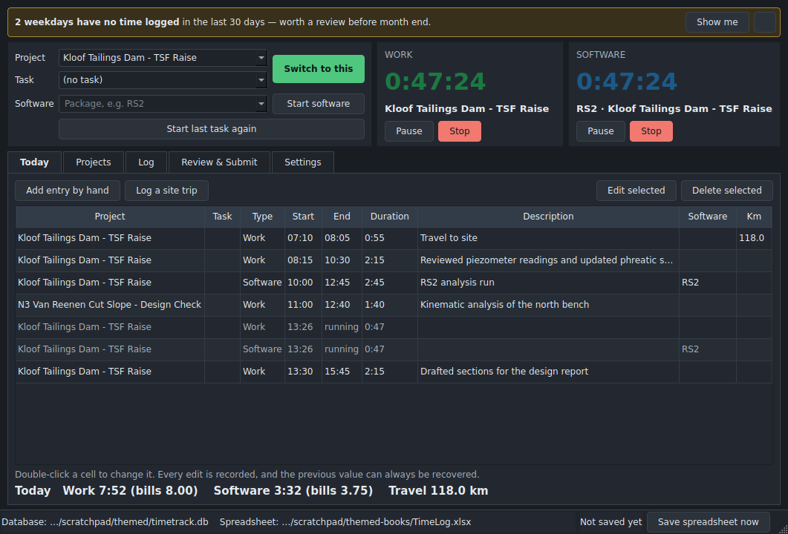
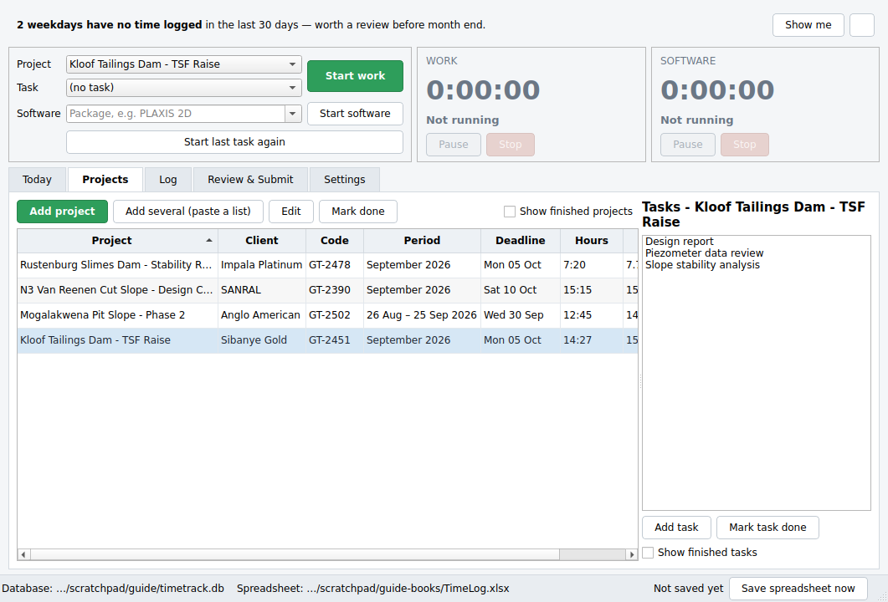
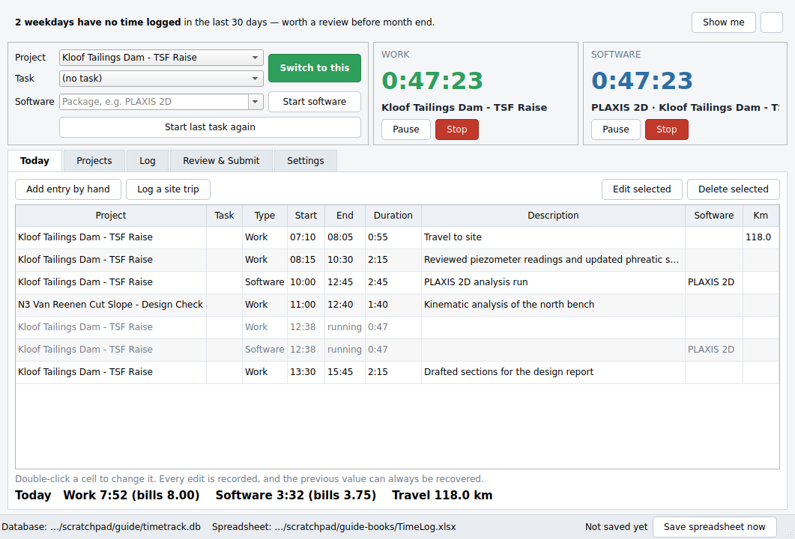
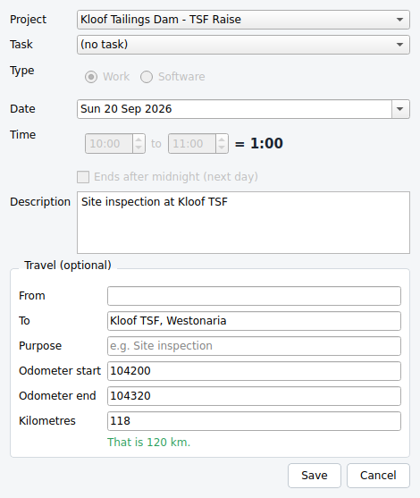
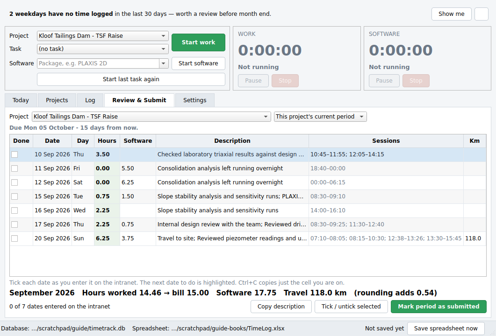

# How to use TimeTrack

This is the everyday guide. There is no jargon in it. If something here
doesn't match what you see on screen, the app is right and this is wrong —
tell me and I'll fix it.

**What it is for:** starting a timer the moment you begin a piece of work, so
that at month end you read your hours off a spreadsheet instead of trying to
remember them.

---

## Contents

1. [Light or dark](#light-or-dark)
2. [Starting it](#starting-it)
3. [First thing: add your projects](#first-thing-add-your-projects)
4. [A normal day](#a-normal-day)
5. [When you forget to start a timer](#when-you-forget-to-start-a-timer)
6. [Logging a site trip](#logging-a-site-trip)
7. [Filling in the intranet timesheet](#filling-in-the-intranet-timesheet)
8. [How your hours are worked out](#how-your-hours-are-worked-out)
9. [The spreadsheet](#the-spreadsheet)
10. [Where your information lives](#where-your-information-lives)
11. [If something goes wrong](#if-something-goes-wrong)
12. [Settings worth knowing about](#settings-worth-knowing-about)

---

## Light or dark

**Settings → Appearance → Theme.** Three choices: *Match this computer*
(the default), *Light*, or *Dark*. It changes straight away — no restart.



The spreadsheet is always produced in light colours whichever you pick,
because it gets printed and shared.

---

## Starting it

Double-click the **TimeTrack** shortcut on your desktop, or find it in the
Start Menu.

To have it open by itself every morning: **Settings** → tick **Start
TimeTrack when I log in**. That is the whole point of the thing — it can't
remind you about a forgotten Tuesday if it isn't running.

**Clicking the X does not close it.** It asks you what you want:

- **Minimise to tray** — it carries on running, and your timers keep going.
  This is what you normally want.
- **Exit TimeTrack** — it stops properly. If a timer is running it tells you
  so, and makes you confirm.
- **Cancel** — never mind.

When it's minimised, look for the small clock in the bottom-right of your
screen, near the date. Its colour tells you what's happening:

| Colour | Meaning |
| ------ | ------- |
| Grey | Nothing running |
| Green | A work timer is running |
| Blue | A software timer is running |
| Half green, half blue | Both are running |
| Amber with two bars | Paused |

Hover over it to see what's running and for how long. Right-click it for
**Start last task**, **Stop all timers**, **Save workbook now** and **Quit**.

---

## First thing: add your projects

Go to the **Projects** tab and click **Add project**.

The only thing that really matters is the **name**. Type it *exactly* as it
appears in the dropdown on the intranet, because you'll be copying it across.

If you have a lot of them, click **Add several (paste a list)**, then copy the
project list out of the intranet dropdown and paste it in — one name per
line. Names you already have are skipped.



Everything else is optional but saves you effort later:

- **Timesheet deadline** — the day of the month it's due. TimeTrack warns you
  when it's coming, and more loudly if it has passed with time still
  unsubmitted.
- **Period** — leave it on *Calendar month* unless your timesheet runs on a
  cycle like the 26th to the 25th, in which case choose *Cutoff cycle*.
- **Usual site** and **Usual round trip (km)** — if your trips to a project
  are usually the same drive, put it here once and it fills itself in.

**Tasks** are optional. If you want to split a project up — "Slope stability
analysis", "Design report" — select the project and use **Add task** on the
right. You never have to use tasks.

**Added one by mistake?** Select it and click **Remove**. It disappears for
good, along with any tasks under it.

The button only works on a project with **no time recorded against it** —
otherwise removing it would take billable hours with it. If there is any time
on it the button is greyed out, and hovering over it explains why. Use **Mark
done** for anything you have actually worked on.

**Finished with a project?** Select it and click **Mark done**. It disappears
from the dropdowns so they stay short, but every hour you booked to it is
kept, and it still appears in your spreadsheet. Tick **Show finished
projects** and click **Bring back** if you need it again.

---

## A normal day



### Starting work

Pick the project at the top left, then click the green **Start work**.

That's it. The big green number counts up.

- **Pause** if you're interrupted — a long phone call about something else.
  Click **Resume** when you're back. The paused minutes are not counted.
- **Stop** when you finish. Your time is saved the instant you click it.
- Starting a different project automatically stops the one that's running, so
  you can just switch without thinking about it.
- **Start last task again** picks up whatever you did last. Most days repeat.

You can type a description at any time — during, or long afterwards.

### Software hours

The blue timer on the right is separate, and it runs **at the same time** as
your work timer.

Type or choose the package (RS2, Slide2, GeoStudio, Leapfrog…) and click
**Start software**. Names you've used before are remembered.

Two things worth knowing:

- Software hours and work hours are **added separately**, not subtracted from
  each other. Sitting at the machine using RS2 for three hours is three
  work hours *and* three software hours.
- A software timer is **never** interrupted, questioned or stopped
  automatically. Leave an analysis running overnight and it records the whole
  night, with no work hours against it. That is exactly what it's for.

### If you walk away

If you leave a **work** timer running and don't touch the keyboard for ten
minutes or more, then when you come back TimeTrack asks:

> No activity from 14:12 to 14:59 (47 min). What should happen to that time?
>
> **Keep it** · **Discard it** · **Keep as a separate entry**

Nothing is ever thrown away unless you say so. If you were reading a report
on paper, keep it. If you were at lunch, discard it.

You can turn this off, or change the ten minutes, in **Settings**.

### The Today tab

Everything you've recorded today, with totals along the bottom.

**Double-click any cell to change it** — the project, the times, the
description, the kilometres. Every change is recorded, and the previous value
can always be recovered, so you can't do any real damage.

Select a row and use **Edit selected** to change everything about it in one
box, or **Delete selected** to remove it. Deleting only hides it — see
[If something goes wrong](#if-something-goes-wrong) to get it back.

---

## When you forget to start a timer

You will. That's what this is for.

**For today:** click **Add entry by hand** on the Today tab. Fill in the
project, the start and end times, and a description.

**For a day last week:** go to the **Log** tab. Set the dates at the top,
then **Add entry by hand**. The Log tab is where you reconstruct a forgotten
week — filter by date and project to see what's already there.

**Finding the gaps:** when you open TimeTrack, if there are working days in
the last month with nothing recorded, a yellow banner says so:

> **6 weekdays have no time logged** in the last 30 days — worth a review
> before month end.

Click **Show me** and it takes you straight to those days.

If a session ran past midnight, tick **Ends after midnight (next day)** in the
entry box. TimeTrack splits it correctly across the two dates by itself.

---

## Logging a site trip

Click **Log a site trip** on the Today tab.



Enter **both odometer readings** and the kilometres work themselves out as
you type. If you put the closing reading in lower than the opening one, it
tells you straight away rather than saving something wrong.

If you didn't note the odometer, just type the kilometres instead. The travel
sheet leaves the odometer columns blank rather than inventing numbers.

Two ways to record travel:

- **A trip on its own** — kilometres, no hours. Use **Log a site trip**.
- **Attached to work** — you drove to site and then worked there. Add or edit
  the entry and fill in the **Travel** section at the bottom.

The Travel sheet in your spreadsheet is laid out the way a **SARS travel
logbook** wants it, so the same sheet does for your timesheet and a travel
claim.

---

## Filling in the intranet timesheet

This is the bit the whole thing exists for. Put TimeTrack on one screen and
the intranet form on the other.

Go to **Review & Submit**. Choose your project and the period.



You get one row per date, in the order you'll type them. Then:

1. **The next date to enter is highlighted in yellow.** Start there.
2. Copy the **Hours** figure into the form. That bold shaded number is the
   one to type — not the raw one.
3. Copy the **Software** hours if there are any.
4. Copy the **Description**. The **Copy description** button puts it on the
   clipboard, or press **Ctrl+C** on any single cell to copy just that cell.
   (The form takes one field at a time, so that's how copying works here.)
5. **Tick the Done box** for that date.

The row goes grey, and the next one lights up yellow. Work down the list.
The count at the bottom left tells you how far you are: *"7 of 19 dates
entered on the intranet"*.

If you close TimeTrack halfway through, your ticks are still there when you
come back.

**Writing your own description:** the description is put together from what
you typed against each entry. If you'd rather write the narrative yourself,
just type over it. Your version is kept and shown in italics, and it's what
goes into the spreadsheet.

**When you've finished**, click **Mark period as submitted**. That stops the
deadline reminders for that period.

---

## How your hours are worked out

Your hours for **one project on one day** are added up, and only then rounded
**up** to the next quarter hour. Individual entries are never rounded on
their own.

| A day of… | You bill |
| --------- | -------- |
| Six 10-minute calls (60 minutes) | **1.00** |
| Five 10-minute calls and one of 11 (61 minutes) | **1.25** |
| Exactly 3 hours | **3.00** |
| 3 hours and 1 minute | **3.25** |

Two projects on the same day are rounded **separately**, each on its own
total.

The spreadsheet always shows both figures — what you actually worked, and
what you bill — and the Summary sheet tells you how many hours a month the
rounding adds up to.

You can change the rounding in **Settings** (quarter hour, tenth of an hour,
half hour, or none; up, nearest, or down). The default is what you asked for:
up, to the quarter hour.

---

## The spreadsheet

**`TimeLog.xlsx`**, in `Documents\TimeTrack\` unless you moved it.

You never have to remember to save it. TimeTrack rewrites it every half hour,
a couple of minutes after you change anything, and when you close it. The
bottom-right of the window always says when it last saved. **Save spreadsheet
now** does it immediately.

**If you have it open in Excel**, TimeTrack waits and tries again, and the
status bar says so. It won't fill your folder with copies. If you click
**Save spreadsheet now** while it's open in Excel, it saves under a dated name
instead — `TimeLog_2026-09-14_1432.xlsx` — and tells you plainly.

What's in it:

| Sheet | What it's for |
| ----- | ------------- |
| **Timesheet** | Every project, one row per project per date. The one you work from. |
| **TS — <project>** | The same for one project on its own. |
| **Raw Log** | Every single entry. Your audit trail — the answer to "what did I actually do on the 14th?" |
| **Travel** | Your kilometre log, in SARS logbook order, with monthly and year-to-date totals. |
| **Projects** | The register: deadlines, hours and kilometres to date. |
| **Summary** | Per project per month, including what the rounding adds. |
| **Gaps** | Working days with nothing recorded. |

Every sheet has filters on the headings and a frozen top row. Dates you've
ticked off are greyed out.

---

## Where your information lives

| What | Where |
| ---- | ----- |
| Your data | `C:\Users\<you>\AppData\Local\TimeTrack\timetrack.db` |
| Backups | `C:\Users\<you>\AppData\Local\TimeTrack\backups\` |
| Spreadsheet | `C:\Users\<you>\Documents\TimeTrack\TimeLog.xlsx` |

The exact paths are shown at the bottom of the window and in **Settings**.

**The database file is the real record.** The spreadsheet is produced *from*
it — so if you edit the spreadsheet by hand, your changes are overwritten the
next time it saves. Make changes in TimeTrack, not in Excel.

**Backups happen by themselves:**

- A copy of your data **every day**, keeping the last 30.
- A copy of the spreadsheet **every week**, keeping the last 52 — a full year.

**Settings** shows how many there are and when the last one was taken, with a
button to open the folder.

> **If your Documents folder is synced to OneDrive**, the spreadsheet can
> occasionally be locked while OneDrive uploads it. TimeTrack handles that
> gracefully, but if it annoys you, use **Settings → Choose folder…** to put
> the spreadsheet somewhere local instead.

---

## If something goes wrong

### The app closed while a timer was running

When you open it again it tells you, and offers a choice:

> A **work** timer for *Kloof Tailings Dam* was running when TimeTrack last
> closed. It was last seen at 14:32 (2h 14m recorded).
>
> **Keep that time** · **Let me set the end time** · **Discard it**

Nothing is lost while you decide.

### I deleted an entry by mistake

Nothing is really deleted. Go to the **Log** tab, tick **Show deleted**, find
it (shown with a line through it), select it and click **Restore selected**.

### I changed an entry and want the old value back

Every change is recorded with what it was before. The old value is in the
database. Tell me the date and the project and I can get it out for you.

### I need to go back to yesterday's data

1. Close TimeTrack.
2. Open `C:\Users\<you>\AppData\Local\TimeTrack\backups\db\`
3. Find the day you want — the files are named `timetrack_2026-09-19.db`.
4. Copy it up one level and rename it `timetrack.db`, replacing the one
   that's there. **Rename the existing one first** — call it
   `timetrack-before-restore.db` — so you can change your mind.
5. Open TimeTrack.

If that feels risky, it is — ask me and I'll walk through it with you.

### Windows antivirus quarantined it

TimeTrack makes **no internet connections at all**. No updates, no telemetry,
nothing. You can tell IT that truthfully.

Ask them to allow this folder:

```
C:\Jhean-Michael\Development\TimeTrack\TimeTrack\dist\TimeTrack\
```

(or wherever you built it — the build prints the exact path at the end).

### The window doesn't appear at all

Rebuild it with `build.cmd -KeepSoftwareOpenGL` and tell me. That puts back a
graphics component left out to keep the download small.

---

## Settings worth knowing about

| Setting | What it does |
| ------- | ------------ |
| **Theme** | Light, dark, or match Windows. Changes immediately. |
| **Time zone** | Leave on *Use this computer's setting* unless you travel. |
| **Round to / Direction** | How hours are rounded. Default: up, to the quarter hour. |
| **Ask me about time when I have been away** | The idle question. Turn it off if it irritates you. |
| **Start TimeTrack when I log in** | Opens it automatically. Recommended. |
| **Ask what to do when I click the X** | Turn off to always minimise to tray. |
| **Keep the spreadsheet up to date by itself** | Leave on. |
| **Also make one tab per project** | A separate sheet per project, as well as the combined one. |
| **Spreadsheet folder** | Where `TimeLog.xlsx` is written. |

---

## The short version

- Pick a project, click **Start work**. Click **Stop** when done.
- Forgot? **Add entry by hand**, on Today or on the Log tab.
- Drove somewhere? **Log a site trip**, and type both odometer readings.
- Month end? **Review & Submit**, work down the list, tick each date off.
- The spreadsheet looks after itself.
